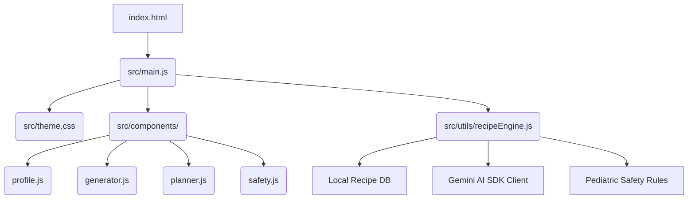
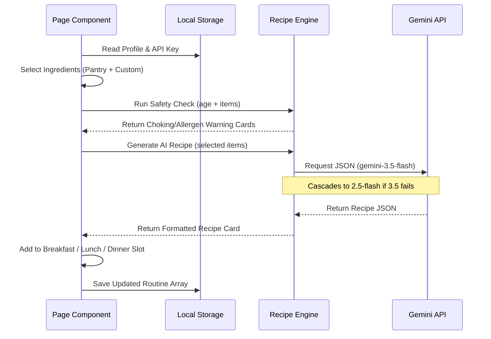

# Architecture Guide

This document outlines the codebase architecture, data flow, and key integration systems of **Todfeed**.

---

## 🏗️ Project Architecture

Todfeed is built as a single-page application (SPA) with modular JavaScript modules and vanilla styling. By avoiding heavy framework structures, it maintains a small footprint and makes transition to a native wrapper (like Capacitor or Android CLI WebView) extremely straightforward.



---

## 📂 Key Folders & Modules

### 1. Central Coordinator: `src/main.js`
*   **Routing:** Listens for the `'navigation-bar-activated'` custom event from `<md-navigation-bar>` and updates the active panel view by toggling classes.
*   **State Coordination:** Coordinates updates from the Baby Profile (saving data, updating local storage) and notifies dependent components (rebuilding the Daily Sheet or clearing matched lists).
*   **Modal Overlay:** Handles click and backdrop events for the center-aligned API Settings modal.

### 2. Utility Core: `src/utils/recipeEngine.js`
*   **Local DB:** Pre-seeds 14 baby food recipes tailored by age range, diet limits, and region.
*   **Safety Checking:** Houses rule validation arrays for honey (under 12m), added salt/sugar, cow's milk limits, and choking hazards (popcorn, whole grapes).
*   **AI Integration:** Client-side Google Gen AI connector with cascading model logic.
*   **Schedule Builder:** Formulates detailed meal sheets dynamically adapted to a baby's age and country (e.g. replacing oatmeal with Ragi Porridge in India, or Rice Okayu in Japan).

### 3. Rendering Components: `src/components/`
*   **`profile.js`:** Captures name, age, country, dietary requirements, and dynamically prints corresponding developmental milestones (e.g. mashed foods vs finger foods).
*   **`generator.js`:** Controls the pantry ingredient chips, custom input text field, safety checking warnings box, and matches/requests recipes.
*   **`planner.js`:** Creates the timeline daily planner. Manages checkmarks, emoji rating triggers, and hooks up the window print API.
*   **`safety.js`:** Hosts weaning style advice cards and runs the search safety checker.

---

## 🔄 State & Data Flow

All persistent state is stored client-side in the browser's `localStorage`:

1.  **`todfeed_profile`**: Stores the name, age, country, diet tags, and allergen tags.
2.  **`todfeed_schedule_<Baby_Name>`**: Stores the array of feeding slots, checkmark completions, and emoji reactions.
3.  **`gemini_api_key`**: Stores the user's Gemini API key securely on their device.



---

## 🤖 Gemini AI Cascading Fallback Strategy

To guarantee the AI generator never breaks due to model deprecation or account-specific model restrictions, the API client implements a cascading fallback loop:

```javascript
const modelsToTry = [
  'gemini-3.5-flash', // Default Stable Version
  'gemini-3.1-pro',
  'gemini-2.5-flash',
  'gemini-2.5-pro'
];
```

*   **Logic:** The client loops through the array, attempting `model.generateContent`. If a model returns an error (like `404 Model Not Found` or `503 Service Unavailable`), it catches the error, logs a warning, and immediately attempts the next model in the list.
*   **Error Protection:** If the key is invalid, the engine catches it instantly and alerts the user to update their credentials in the Settings modal without trying other models.
