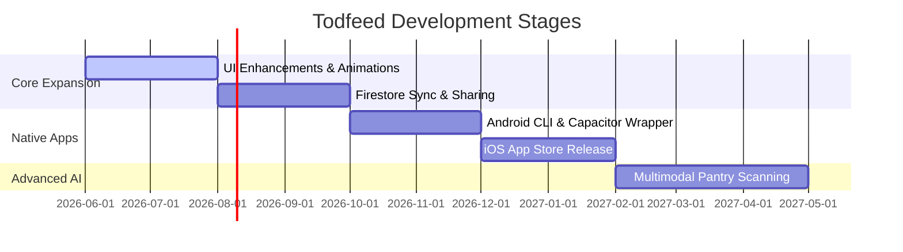

# Todfeed Product Roadmap 🦖

This document outlines the planned future features, development goals, and architectural expansions for **Todfeed**.

---

## 🗺️ Roadmap Overview

---

## 🚀 Future Milestones

### 1. Phase 1: Interactive & Visual Polish (Near Term)
*   **Delightful Micro-animations:** Add playful animated transitions (e.g. confetti pops or sliding animations) when a parent checks off the "Mark Eaten" button.
*   **Baby Growth Mascot:** Give the baby dinosaur mascot visual changes (e.g., growing slightly, wearing different bibs or hats) as you change the baby's age in the profile panel.
*   **Expand Safety Search:** Seed the local safety search list with 100+ additional ingredients, including choking hazard preparation guidelines for fruits, meats, and grains.

### 2. Phase 2: Caregiver Sync & Cloud Integrations (Medium Term)
*   **Firebase Firestore Sync:** Add optional Cloud Firestore database support. This allows parents to sync baby profiles and daily feed logs securely to the cloud.
*   **Caregiver Sharing:** Let parents invite partners, grandparents, or nannies to view and check off meals from the same Daily Sheet in real-time.
*   **Secure API Gateway & Google Sign-In:** Remove client-side API key inputs. Integrate Firebase Auth (Google Sign-In) and route all Gemini AI calls through a secure cloud function proxy (API Gateway) that handles rate limits and billing.
*   **Offline First support:** Implement Service Workers and Workbox to enable a full Progressive Web App (PWA) experience, ensuring the app works perfectly in kitchens with poor Wi-Fi.

### 3. Phase 3: Android & iOS Mobile Release (Targeted)
*   **Mobile Wrapper (Capacitor/Cordova):** Wrap the Vite frontend package using **Capacitor** to build native Android and iOS apps.
*   **Push Notifications:** Send friendly reminders for snack times, morning bottle sessions, or logging reaction checks.
*   **PDF Export to Share Sheets:** Integrate native share sheets to allow exporting printable Daily Sheets directly to WhatsApp, email, or local printers.

### 4. Phase 4: Multimodal AI (Long Term)
*   **Pantry Photo Scanner:** Integrate Google Gemini's multimodal capabilities (vision). A parent can take a photo of their refrigerator shelves or pantry cabinet, and Gemini will automatically extract the ingredients list and select them in the pantry picker.
*   **Growth Tracking Integration:** Connect baby feeding reactions with weight/height tracking charts to provide automated pediatric suggestions (e.g. recommending more iron-rich foods if growth targets shift).
